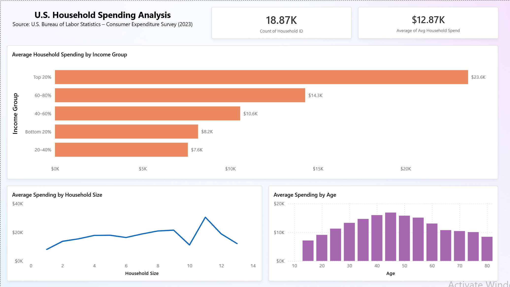

# U.S. Household Spending Analysis (Power BI)

## Overview
This project analyzes U.S. household spending patterns using data from the Consumer Expenditure Survey (CES).
The dashboard explores how average household spending varies by income group, household size, and age.

## Data Source
- U.S. Bureau of Labor Statistics (BLS)
- Consumer Expenditure Survey (2023)
- Unit of analysis: Household

## Tools Used
- Power BI Desktop
- Excel (data preparation)

## Key Metrics
- Average household spending
- Household count
- Spending by income percentile
- Spending by age and household size

## Dashboard Insights
- Higher income households spend significantly more on average, with the top 20% spending nearly 3x more than the bottom 20%.
- Spending increases with household size up to a point, then declines for very large households.
- Average household spending peaks in middle age (approximately 40–55) and declines in later years.

## Files Included
- `consumer_spending_clean.xlsx` – cleaned dataset
- `household_spending_dashboard.pbix` – Power BI dashboard
- `dashboard_screenshot.png` – preview image

## Dashboard Preview

